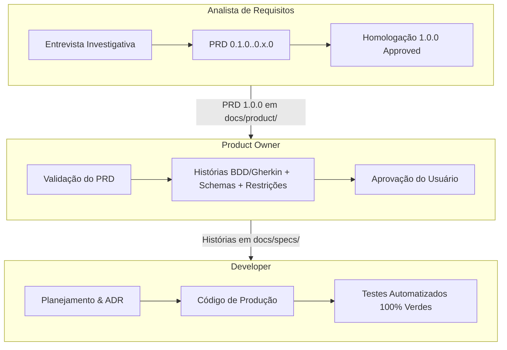

# DevTeam: Time Multi-Agente de Engenharia Ágil & Docs-as-Code

Bem-vindo ao **DevTeam**, um ecossistema multi-agente de desenvolvimento de software de alta performance para o Google Antigravity e VS Code, orientado à governança **Docs-as-Code**.

O DevTeam estrutura três papéis essenciais e independentes que trabalham em pipeline contínuo, cobrindo todo o ciclo de vida do software: **Features**, **Correção de Bugs (TDD Red/Green)** e **Decisões de Arquitetura (ADRs)**.



---

## 1. As Três Trilhas Operacionais

### 1.1. Trilha de Novas Funcionalidades (Evolução)
* **Analista de Requisitos (AR)**: Elicitação exaustiva de requisitos em `./docs/product/prd-<feature>.md`.
* **Product Owner (PO)**: Decomposição em Histórias de Usuário em `./docs/specs/us-<feature>.md` contendo critérios Gherkin, contratos JSON opcionais, testes e restrições ("O que NÃO fazer").
* **Developer**: Implementação TDD com garantia de testes locais verdes.

### 1.2. Trilha de Sustentação de Bugs (Bug Track)
* Erro reportado com evidências e payload.
* Skill `diagnostico-bug` gera especificação em `./docs/specs/bug-<slug>.md`.
* **Developer** aplica o ciclo **TDD Red/Green**: primeiro cria o teste que reproduz a falha (Red) e depois aplica a correção até passar (Green) sem regressão.

### 1.3. Trilha de Decisão Arquitetural (Architecture Track)
* Dilema técnico de persistência, framework ou dependência de infraestrutura.
* Registro formal em `./docs/architecture/adr-<001>-<slug>.md` avaliando alternativas, prós, contras e trade-offs.

---

## 2. Como Usar no Antigravity

Você pode interagir com o time no chat do Antigravity através de comandos ou linguagem natural:

* **Iniciar o Ciclo Completo de Feature**:
  > *"Vamos iniciar a funcionalidade de autenticação por e-mail com o DevTeam."*  
  *(Ativa a skill `devteam-pipeline` que guia você pelas fases).*

* **Acionar Fases ou Trilhas Específicas**:
  - **Fase de Requisitos**: *"Atue como o Analista de Requisitos e me entreviste sobre o recurso X."*
  - **Fase de Refinamento**: *"Atue como o Product Owner e refine as histórias para o PRD v1.0 do recurso X."*
  - **Correção de Bug**: *"Atue como o time para diagnosticar o erro 500 no endpoint de checkout."*
  - **Decisão Arquitetural**: *"Registre uma ADR para avaliar a migração de SQLite para PostgreSQL."*

---

## 3. Utilitários de Linha de Comando (`cli.py` / `cli.ps1`)

O DevTeam disponibiliza scripts multiplataforma para terminal (Python ou PowerShell nativo):

```bash
# Inspecionar PRDs, USs, Bugs e ADRs ativos
python cli.py status
.\cli.ps1 status

# Criar um novo PRD oficial com Frontmatter YAML
python cli.py new-prd autenticacao-otp
.\cli.ps1 new-prd autenticacao-otp

# Criar uma nova História de Usuário (US) blindada
python cli.py new-us login-google
.\cli.ps1 new-us login-google

# Criar uma especificação de Bug com roteiro TDD Red/Green
python cli.py new-bug erro-500-token
.\cli.ps1 new-bug erro-500-token

# Registrar uma Decisão de Arquitetura (ADR com numeração automática)
python cli.py new-adr adocao-fastapi
.\cli.ps1 new-adr adocao-fastapi

# Criar um protótipo de tela interativo em React + Tailwind (Living Spec)
python cli.py new-proto checkout-fluxo
.\cli.ps1 new-proto checkout-fluxo

# Inicializar um novo projeto para receber o DevTeam (com AGENTS.md e docs/prototypes)
python cli.py init-repo C:\Dev\Projetos\NovoApp
.\cli.ps1 init-repo C:\Dev\Projetos\NovoApp
```

---

## 4. Estrutura de Diretórios do DevTeam

```text
C:\Dev\Projetos\Particular\DevTeam\
├── rules/
│   └── GEMINI.md                             # Governança mestre, 3 trilhas e naming conventions
├── skills/
│   ├── devteam-pipeline/                     # Orquestrador do fluxo completo (com Gate 0)
│   ├── analise-requisitos/                   # Habilidade do Analista (PRD)
│   ├── refinamento-po/                       # Habilidade do PO (US / BDD)
│   ├── desenvolvimento/                      # Habilidade do Developer (TDD / Prototipação)
│   ├── prototipacao-ui/                      # Habilidade de prototipação visual em React
│   ├── diagnostico-bug/                      # Habilidade de triagem de bugs (Red/Green)
│   └── decisao-arquitetural/                 # Habilidade de ADRs arquiteturais
├── config/
│   └── model_router.json                     # Matriz de LLMs por papel
├── docs/
│   └── templates/
│       ├── PRD-template.md                   # Modelo oficial com Frontmatter YAML
│       ├── STORY-template.md                 # Modelo de Histórias (BDD + Schemas + Restrições + Protótipo)
│       ├── BUG-template.md                   # Modelo de Bug (Causa Raiz + TDD)
│       └── ADR-template.md                   # Modelo de Decisão Arquitetural
├── templates/
│   └── repo-blueprint/
│       └── AGENTS.md                         # Blueprint mestre para novos repositórios
├── cli.py                                    # Utilitário CLI Python
├── cli.ps1                                   # Utilitário CLI PowerShell
├── plugin.json                               # Manifesto do plugin Antigravity
└── README.md                                 # Este manual
```
