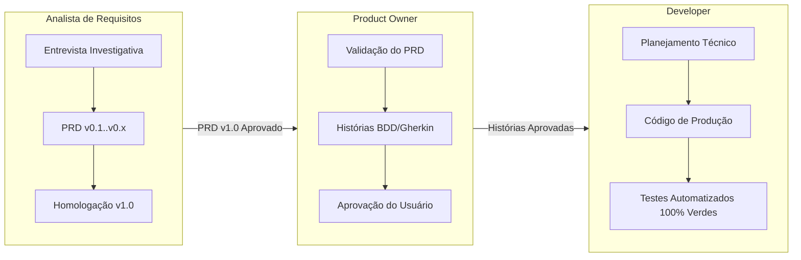

# DevTeam: Time Multi-Agente de Engenharia Ágil

Bem-vindo ao **DevTeam**, um ecossistema multi-agente de desenvolvimento de software de alta performance para o Google Antigravity e VS Code.

O DevTeam estrutura três papéis essenciais e independentes que trabalham em pipeline contínuo, com foco em clareza de requisitos, valor de negócio e testes automatizados.



---

## 1. Os Três Papéis e Suas Regras

### 1.1. Analista de Requisitos (AR)
* **LLM**: `gemini-2.5-flash` (rápido, conversacional, contexto massivo e custo mínimo).
* **Protocolo Mandatório**: **Proibido finalizar requisitos na primeira interação**. O AR formula rodadas exaustivas de perguntas cobrindo problemas de negócio, escopo, regras de exceção e limites técnicos.
* **Saída Obrigatória**: PRD formal versionado em `./docs/prds/PRD-v1.0-<feature>.md`.

### 1.2. Product Owner (PO)
* **LLM**: `gemini-2.5-flash` (alta precisão sintática em tabelas e formatação Gherkin).
* **Portão de Bloqueio**: Rejeita qualquer demanda cujo PRD não seja `v1.0 (Aprovado)`.
* **Saída Obrigatória**: Histórias em `./docs/stories/STORY-<feature>.md` com critérios `Dado / Quando / Então` e aprovação humana registrada antes da implementação.

### 1.3. Developer
* **LLM**: `gemini-2.5-pro` (ou `flash` com thinking para lógica avançada de código).
* **Diretriz**: Desenvolvimento orientado a testes (TDD). Mapeia 100% dos cenários Gherkin para testes automatizados locais.

---

## 2. Como Usar no Antigravity

Você pode interagir com o time no chat do Antigravity através de comandos ou linguagem natural:

* **Iniciar o Ciclo Completo**:
  > *"Vamos iniciar a funcionalidade de autenticação por e-mail com o DevTeam."*  
  *(Ativa a skill `devteam-pipeline` que guia você pelas 3 fases).*

* **Acionar Fases Individuais**:
  - **Fase de Requisitos**: *"Atue como o Analista de Requisitos e me entreviste sobre o recurso X."*
  - **Fase de Refinamento**: *"Atue como o Product Owner e refine as histórias para o PRD v1.0 do recurso X."*
  - **Fase de Desenvolvimento**: *"Atue como o Developer e implemente as histórias aprovadas com testes."*

---

## 3. Como Usar no VS Code

Você tem total liberdade para usar este mesmo time diretamente dentro do **VS Code**:

1. Abra a pasta do seu projeto no VS Code (`File > Open Folder`).
2. Abra o terminal integrado (`Ctrl + ~` ou ``Ctrl + ` ``).
3. Inicie o Antigravity CLI:
   ```bash
   agy
   ```
4. O assistente lerá as regras do DevTeam e você poderá conversar normalmente. Conforme o Developer cria e edita código, você vê os arquivos abrindo e sendo modificados ao vivo na sua janela do VS Code!

---

## 4. Utilitário de Suporte (`cli.py`)

No terminal, você pode rodar ferramentas de apoio:

```bash
# Verificar PRDs e Histórias ativas
python cli.py status

# Criar um novo rascunho de PRD a partir do template oficial
python cli.py new-prd minha-nova-feature

# Inicializar um novo projeto para receber o DevTeam
python cli.py init-repo C:\Dev\Projetos\NovoApp

# Consultar a matriz de modelos e estratégias de escalação
python cli.py models
```

---

## 5. Estrutura de Diretórios

```text
C:\Dev\Projetos\DevTeam\
├── .agents/
│   ├── rules/
│   │   ├── 01-analista-requisitos.md    # Regra de esgotamento e versionamento
│   │   ├── 02-product-owner.md           # Critérios BDD e portões DoR/DoD
│   │   └── 03-developer.md               # Padrões técnicos e testes
│   └── skills/
│       ├── devteam-pipeline/             # Orquestrador do fluxo completo
│       ├── analise-requisitos/           # Habilidade do Analista
│       ├── refinamento-po/               # Habilidade do PO
│       └── desenvolvimento/              # Habilidade do Developer
├── config/
│   └── model_router.json                 # Matriz de LLMs por papel
├── docs/
│   ├── prds/                             # Repositório de PRDs versionados
│   ├── stories/                          # Repositório de Histórias BDD
│   └── templates/
│       ├── PRD-template.md               # Modelo oficial de PRD
│       └── STORY-template.md             # Modelo oficial de Histórias
├── templates/
│   └── repo-blueprint/                   # Blueprint para novos repositórios
├── cli.py                                # Utilitário de linha de comando
├── GEMINI.md                             # Governança do workspace
├── plugin.json                           # Manifesto do plugin Antigravity
└── README.md                             # Este manual
```
