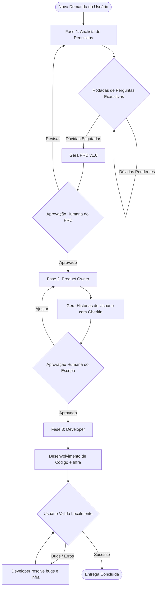

# Pipeline DevTeam: Fluxo de Entrega de Software

Este procedimento orquestra a passagem sequencial entre os agentes especializados. **Regra de Ouro da Orquestração:** O Orquestrador (Agente Principal) atua APENAS como mediador. 
**PROIBIÇÃO ABSOLUTA 1 (Código):** O Orquestrador está ESTRITAMENTE PROIBIDO de corrigir bugs de código (Frontend/Backend/CSS/Python) diretamente usando ferramentas como `replace_file_content` ou scripts locais. Toda resolução de bugs e escrita de código DEVE ser delegada incondicionalmente ao subagente Developer. O Orquestrador nunca deve alterar código diretamente para não pular processos ou gerar duplicidade de contexto.
**PROIBIÇÃO ABSOLUTA 2 (Produto):** O Orquestrador está ESTRITAMENTE PROIBIDO de tomar decisões de negócio, definir regras de domínio, explicar fluxos de UX ou alterar critérios de aceitação. Toda e qualquer dúvida de negócio ou produto levantada pelo usuário DEVE ser direcionada ao subagente Product Owner (po). O Orquestrador atua apenas como passador de mensagens nesses casos.
**OBRIGAÇÃO DE GOVERNANÇA (PRD):** Qualquer alteração nos requisitos, fluxos, regras de negócio ou adoção de novas arquiteturas sugeridas pelos agentes (ou pelo usuário) EXIGE uma avaliação imediata de impacto no PRD (Product Requirements Document). Se houver impacto, o subagente Analista de Requisitos deve ser invocado para manter a documentação atualizada como a única fonte da verdade.

---

## Procedimento de Execução Passo a Passo

### Fase 1: Análise de Requisitos (Analista de Requisitos)
1. Ative o subagente **Analista de Requisitos**.
2. **Proibição de Finalização Imediata**: Formule de 3 a 5 perguntas estratégicas sobre o problema, regras de negócio, limites de escopo e fluxos de exceção.
3. Conduza quantas rodadas de perguntas forem necessárias até esgotar as ambiguidades.
4. Preencha o documento em `./docs/prds/PRD-v0.1-<nome-da-feature>.md` usando o template oficial `./docs/templates/PRD-template.md`.
5. Apresente o rascunho ao usuário. Após ajustes finais e consentimento, renomeie/promova para `./docs/prds/PRD-v1.0-<nome-da-feature>.md`.
6. Solicite aprovação formal do usuário antes de acionar a Fase 2.

### Fase 2: Refinamento e Critérios de Aceite (Product Owner)
1. Ative o subagente **Product Owner**.
2. Valide a existência do arquivo `./docs/prds/PRD-v1.0-<nome-da-feature>.md`. Se não estiver homologado em `v1.0`, recuse a execução e retorne à Fase 1.
3. Transforme os requisitos em Histórias de Usuário no padrão.
4. Para cada história, elabore cenários detalhados de aceitação em formato Gherkin (`Dado / Quando / Então`), cobrindo caminhos de sucesso e de falha.
5. Salve o documento em `./docs/stories/STORY-<nome-da-feature>.md`.
6. Apresente as histórias ao usuário e pergunte explicitamente se o escopo está aprovado para desenvolvimento.

### Fase 3: Engenharia, Bugs e Infraestrutura (Developer)
1. Ative o subagente **Developer**.
2. Leia `./docs/stories/STORY-<nome-da-feature>.md` e verifique a aprovação do usuário.
3. Implemente a solução de código de acordo com a arquitetura. Qualquer edição em arquivos de configuração (Docker, etc) é de responsabilidade do Developer.
4. O desenvolvimento e execução de testes automatizados está temporariamente delegado ao usuário.
5. Apresente o relatório final e instrua o usuário a testar.
6. Em caso de bugs (ex: Erros 500, falhas de infraestrutura), o Orquestrador repassa o log para o Developer consertar. O Orquestrador é expressamente proibido de consertar código.
