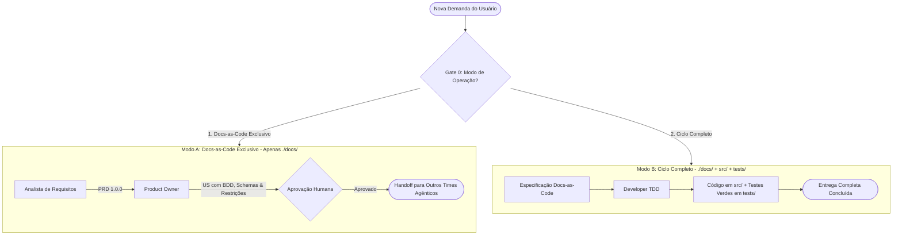

# Pipeline DevTeam: Fluxo de Entrega de Software

Este procedimento orquestra a passagem sequencial entre os agentes especializados. **Regra de Ouro da Orquestração:** O Orquestrador (Agente Principal) atua APENAS como mediador e garantidor de escopo.

---

## Gate 0: Verificação Obrigatória do Modo de Operação

Antes de acionar qualquer agente especialista, o Orquestrador **DEVE** verificar o modo de operação configurado no `AGENTS.md` do repositório ou **perguntar explicitamente ao usuário**:

> *"Qual será o escopo de atuação do DevTeam neste projeto?*  
> *1. **Docs-as-Code Exclusivo**: Atuação restrita à pasta `./docs/` (geração de PRDs, Histórias BDD com restrições, Schemas e ADRs), **sem tocar em nada fora de docs**. A codificação será feita por outros times agênticos ou desenvolvedores.*  
> *2. **Ciclo Completo (End-to-End)**: O DevTeam cobrirá tanto a especificação quanto a codificação em `src/` e testes em `tests/`.*"

### 🛡️ Regra de Blindagem do Modo Docs-as-Code Exclusivo:
Se o usuário selecionar **Docs-as-Code Exclusivo**:
- **PROIBIÇÃO TOTAL FORA DE DOCS:** Nenhum agente (AR, PO ou Developer) tem permissão para criar, editar ou apagar arquivos fora da pasta `./docs/`.
- **ENCERRAMENTO DE CICLO:** O pipeline é dado como CONCLUÍDO assim que o usuário aprovar o PRD, as Histórias em `./docs/specs/` ou o ADR em `./docs/architecture/`.
- **HANDOFF EXTERNO:** O Orquestrador apresenta o índice dos artefatos gerados em `docs/` e notifica que o pacote está pronto para consumo por outros times de desenvolvimento.

---

---

## Procedimento de Execução Passo a Passo

### Fase 1: Análise de Requisitos (Analista de Requisitos)
1. Conduz perguntas investigativas e gera o PRD em `./docs/product/prd-<nome-da-feature>.md` (com Frontmatter YAML).
2. Versão `1.0.0 (Approved)` é obrigatória para prosseguir.

### Fase 2: Refinamento e Critérios de Aceite (Product Owner)
1. Valida o PRD e gera as Histórias de Usuário em `./docs/specs/us-<nome-da-feature>.md`, contendo narrativa ágil, cenários Gherkin, contratos JSON (se houver), diretrizes de teste e restrições ("O que NÃO fazer").
2. Solicita aprovação formal do usuário.
3. **Se Modo Docs-as-Code Exclusivo:** O processo encerra aqui com sucesso. O Orquestrador instrui como repassar os arquivos de `docs/specs/` para outros times de execução.

### Fase 3: Engenharia e Código (Developer) - *Apenas no Modo Ciclo Completo*
1. Lê `./docs/specs/` e respeita todas as regras e restrições.
2. Implementa o código em `src/` e suíte de testes em `tests/`, garantindo 100% dos testes verdes.
3. Se houver decisões estruturais de arquitetura durante o dev, registra em `./docs/architecture/adr-*.md`.
